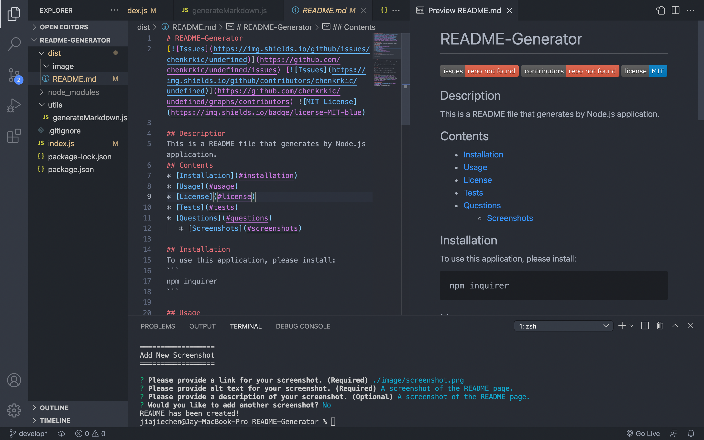

# README-Generator
[](https://github.com/chenkrkic/undefined/issues) [](https://github.com/chenkrkic/undefined/graphs/contributors) 
   
## Description
This is a README file that generates by Node.js application.
## Contents
* [Installation](#installation)
* [Usage](#usage)
* [License](#license)
* [Tests](#tests)
* [Questions](#questions)
   * [Screenshots](#screenshots)

## Installation
To use this application, please install:
```
npm inquirer
```
 
## Usage
Please first clone the repo, then use the command line to start/ open the application by typing "node index". 
 
## License
This application is licensed under the MIT license.
 
## Tests
To run tests on the application, install
```
There is no test for this application.
```
and run `npm run test` from the command line.
 
## Questions
If you have any questions about the repo, please [open an issue](https://github.com/chenkrkic/undefined/issues) or contact me via email at ga-kit@hotmail.com. You can find more of my work on my GitHub, [chenkrkic](https://github.com/chenkrkic/).
 
### Screenshots

A screenshot of the README page.

